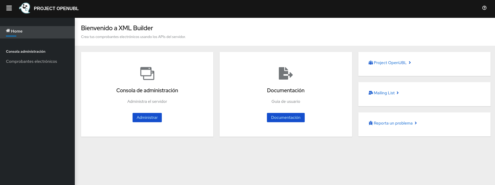
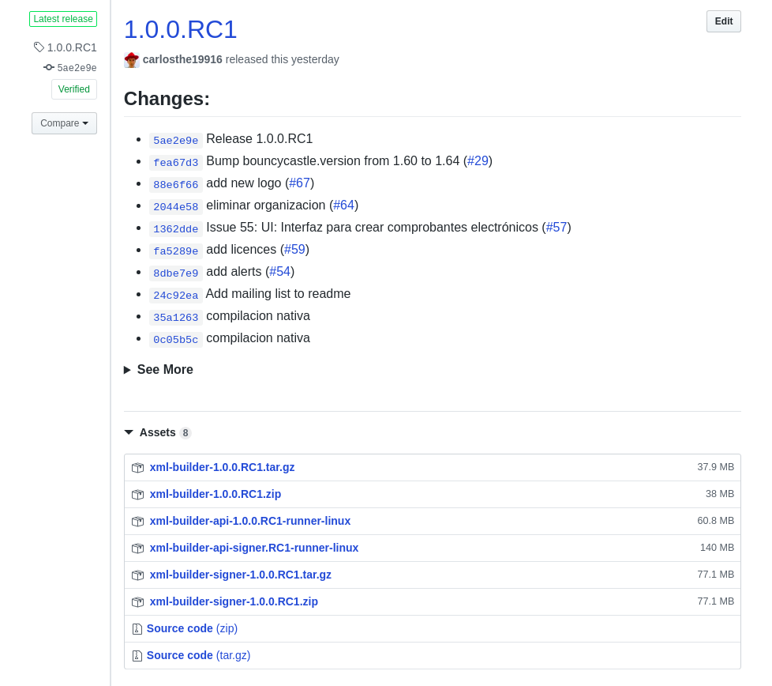
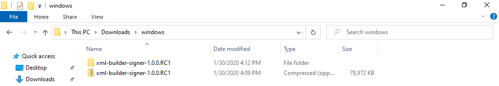
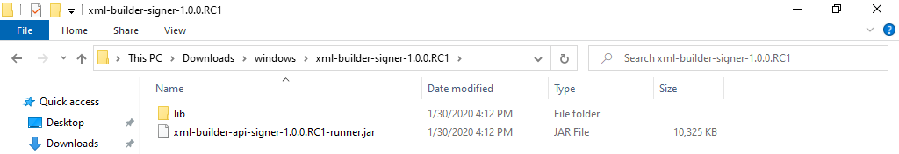
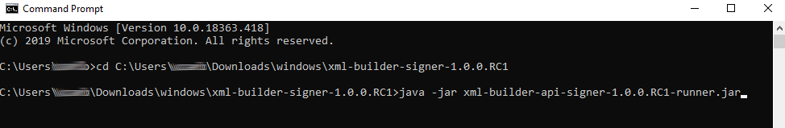
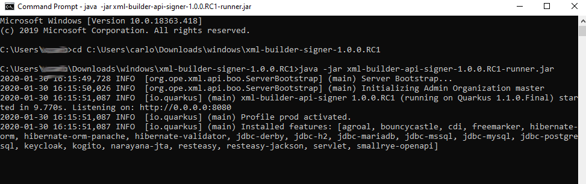

# Instalación
La instalación y configuración puede variar entre XML Builder y XML Builder Signer.

- [XML Builder](#XML-Builder)
- [XML Builder Signer](#XML-Builder-Signer)
- [Usuarios Windows](#Para-Usuarios-Windows)

El servidor **XML Builder** o **XML Builder Signer** pueden ser levantados utilizando diferentes métodos. Se recomienda utilizar Docker, Podman, Openshift, Kubernetes para produción; la lista de imágenes pueden ser encontradas en:

- https://hub.docker.com/r/projectopenubl/xml-builder
- https://hub.docker.com/r/projectopenubl/xml-builder-signer

# XML Builder


## Docker o Podman
Requisitos:
- Tener instalado [Docker](https://www.docker.com/). Puedes utilizar la siguiente [guía de instalación](https://docs.docker.com/install/). Ó
- Tener instalado [Podman](https://podman.io/)

Levantar el servidor **XML Builder** es muy sencillo, solamente tienes que abrir un terminal y ejecutar el siguiente comando:

```
docker run -p 8080:8080 projectopenubl/xml-builder
```
Ó
```
podman run -p 8080:8080 projectopenubl/xml-builder
```

Eso es todo, podrás ver el servidor en http://localhost:8080

## Java
Requisitos:

- Tener instalado Java

Pasos para levantar el servidor
- Descargar el servidor desde https://github.com/project-openubl/xml-builder/releases
- Descomprimir el archivo descargado en el paso anterior
- Abrir un terminal y ubicarse en la carpeta donde el servidor fue extraido
- Ejecutar el siguiente comando: 

```
java -jar xml-builder-api-*-runner.jar
```

Eso es todo, podrás ver el servidor en http://localhost:8080

# XML Builder Signer


## Docker
Requisitos:

- Tener instalado [Docker](https://www.docker.com/). Puedes utilizar la siguiente [guía de instalación](https://docs.docker.com/install/)

### Ejemplo PostgreSQL
#### Crea un network

```
docker network create xml-builder-network
```

#### Inicia una instancia PostgreSQL
Ininia una instancia PostgreSQL usando una imagen Docker de PostgreSQL:

```
docker run -d --name postgres --net xml-builder-network \
-e POSTGRES_DB=db_name \
-e POSTGRES_USER=db_username \
-e POSTGRES_PASSWORD=db_password \
postgres
```

#### Inicia una instancia XML Builder Signer
Iniciar una instancia de XML Builder Signer y conectalo a la instancia PostgreSQL:

```
docker run --name xml-builder --net xml-builder-network -p 8080:8080 \
-e QUARKUS_DATASOURCE_URL=jdbc:postgresql://postgres:5432/db_name \
-e QUARKUS_DATASOURCE_USERNAME=db_username \
-e QUARKUS_DATASOURCE_PASSWORD=db_password \
-e QUARKUS_DATASOURCE_DRIVER=org.postgresql.Driver \
projectopenubl/xml-builder-signer
```

## Java
Requisitos:

- Tener instalado Java

Pasos para levantar el servidor
- Descargar el servidor desde https://github.com/project-openubl/xml-builder-signer/releases
- Descomprimir el archivo descargado en el paso anterior
- Abrir un terminal y ubicarse en la carpeta donde el servidor fue extraido
- Ejecutar el siguiente comando: 

```
java -jar xml-builder-api-signer*-runner.jar
```

Eso es todo, podrás ver el servidor en http://localhost:8080

# Para Usuarios Windows
Si usas el sistema operativo Windows, deberías de ser capaz de levantar **XML Builder** y **XML Builder Signer** sin ningún problema. Todos los comandos descritos en las secciones anteriores son válidos.

Ejemplo:

- Descargar la última version disponible archivo `xml-builder-signer-*.zip` desde la página [Release](https://github.com/project-openubl/xml-builder/releases)



- Descomprimir el archivo `.zip` descargado


    
- El contenido del archivo `.zip` debe de ser parecido a:
    


- Abrir un terminal y dirigirse a la carpeta donde descomprimiste el archivo `.zip`
- Levantar el servidor ejecutando el comando:

```
java -jar xml-builder-signer-*-runner.jar
```

***Nota: recuerda cambiar el comando anterior y utilizar el nombre del archivo `.jar` según
la version que descargaste.***



- Debes de esperar unos segundos y deberías de ver el siguiente resultado:



Eso es todo, podrás ver el servidor en http://localhost:8080