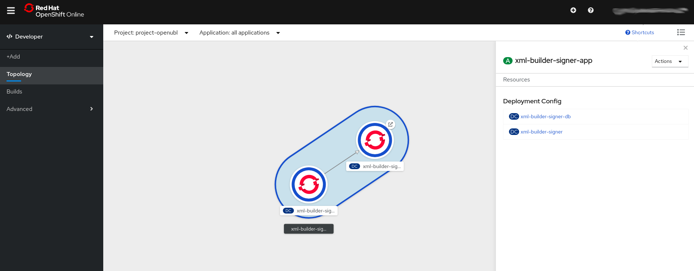

# Openshift
XML Builder puede ser desplegado fácilmente en [Kubernetes](https://kubernetes.io/) y/o [Openshift](https://www.openshift.com/). Openshift te permite utilizar todos los beneficios de una plataforma empresarial basada en contenedores.

Las plantillas Openshift del proyecto se encuentran en `api/src/main/kubernetes/openshift.yml` y `api-signer/src/main/kubernetes/openshift.yml`. Para conocer un poco más sobre plantillas Openshift puedes leer la documentación oficial [acá](https://docs.openshift.com/container-platform/4.3/openshift_images/using-templates.html).

## Desplegar XML Builder
- Clonar el repositorio:

```
git clone https://github.com/project-openubl/xml-builder.git
```

- Mover tu terminal al proyecto descargado:

```
cd xml-builder
```

- Openshift CLI login:

```
oc login --server=https://miservidor
```

Puedes encontrar más información en la documentación oficial: [CLI logging](https://docs.openshift.com/container-platform/4.3/cli_reference/openshift_cli/getting-started-cli.html#cli-logging-in_cli-developer-commands).


- Crear un proyecto openshift:

```
oc new-project project-openubl
```

- Deplegar la aplicación usando plantillas:

Para XML Builder:
```
oc process -f api/src/main/kubernetes/openshift.yml | oc create -f -
```

Para XML Builder Signer:
```
oc process -f api-signer/src/main/kubernetes/openshift.yml | oc create -f -
```

Eso es todo, la aplicación deberá de estar desplegada en tu servidor:



## Parámetros disponibles en las plantillas

-  **Para XML Builder**:

| Parameter        | Default           | Possible values  |
| ------------- |:-------------:| -----:|
| XML_BUILDER_IMAGE_TAG      | latest | [tags](https://hub.docker.com/r/projectopenubl/xml-builder/tags) |


- **Para XML Builder Signer:**


| Parameter        | Default           | Possible values  |
| ------------- |:-------------:| -----:|
| XML_BUILDER_IMAGE_TAG      | latest | [tags](https://hub.docker.com/r/projectopenubl/xml-builder-signer/tags) |
| POSTGRESQL_USER      | Auto generated | - |
| POSTGRESQL_PASSWORD      | Auto generated | - |
| POSTGRESQL_VERSION      | 10 | - |
| VOLUME_CAPACITY      | 1Gi | - |

