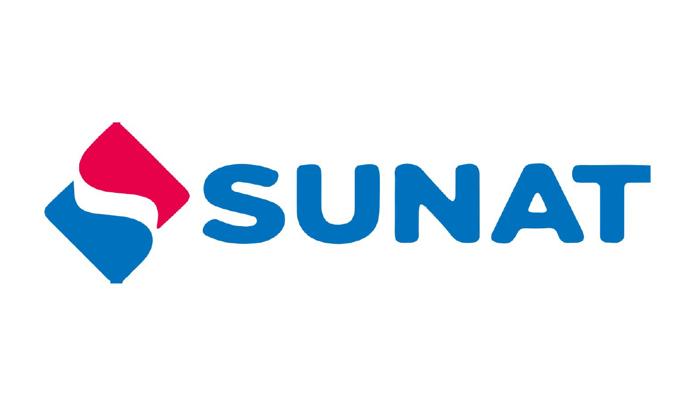

# SUNAT

Puedes encontrar la documentación oficial en el siguiente link:

## Guías y manuales
Revisa y lee la documentación oficial sobre facturación electrónica:

- [Guías y manuales](http://orientacion.sunat.gob.pe/index.php/empresas-menu/comprobantes-de-pago-empresas/comprobantes-de-pago-electronicos-empresas/see-operador-de-servicios-electronicos/7065-guias-y-manuales)

### Percepcion y Retencion
- [Manual percepcion](http://contenido.app.sunat.gob.pe/insc/ComprobantesDePago+Electronicos/Guia_XML_Comprobante_Percepcion_v1.0.pdf)
- [Manual retención](http://contenido.app.sunat.gob.pe/insc/ComprobantesDePago+Electronicos/Guia_XML_Comprobante_Retencion_v1.0.pdf)

### Guía de remisión
- [Manual](http://contenido.app.sunat.gob.pe/insc/ComprobantesDePago+Electronicos/Guia_GUIA_REMISION_REMITENTE.pdf)

### Catálogos
- [Catálogos](http://www.sunat.gob.pe/legislacion/superin/2017/anexoVII-117-2017.pdf)

## Consulta de Validez del Comprobante de Pago Electrónico
Verifique que su comprobante electrónico está registrado correctamente en los sistemas de la SUNAT:

- [Constancia validez del CPE](https://e-consulta.sunat.gob.pe/ol-ti-itconsvalicpe/ConsValiCpe.htm?fbclid=IwAR0HcxKk2VfqC164LMkZNePYHmQkkMzHa6IGwV6U1sDwx2yNIImfHuRdz2o)

- [Manual de consulta integrada de comprobante de pago por servicio web](http://cpe.sunat.gob.pe/sites/default/files/inline-files/Manual-de-Consulta-Integrada-de-Comprobante-de-Pago-por-ServicioWEB_v2.pdf)

## Servicios Web
Verifica los servicios web de la SUNAT que están disponibles para el envio de comprobantes electrónicos:

- [Servicios web disponibles](http://orientacion.sunat.gob.pe/index.php/empresas-menu/comprobantes-de-pago-empresas/comprobantes-de-pago-electronicos-empresas/see-desde-los-sistemas-del-contribuyente/988-guias-manuales-y-servicios-web)

## Certificado digital tributario
Lee sobre la disposición de la SUNAT de poner a su disposición el Certificado Digital Tributario (CDT) gratuito.

- [Certificado digital tributario](http://cpe.sunat.gob.pe/certificado-digital-tributario)